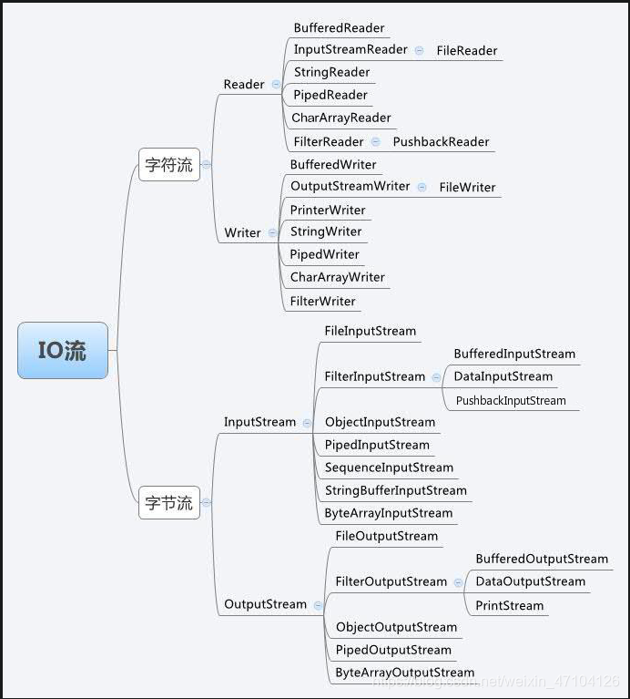
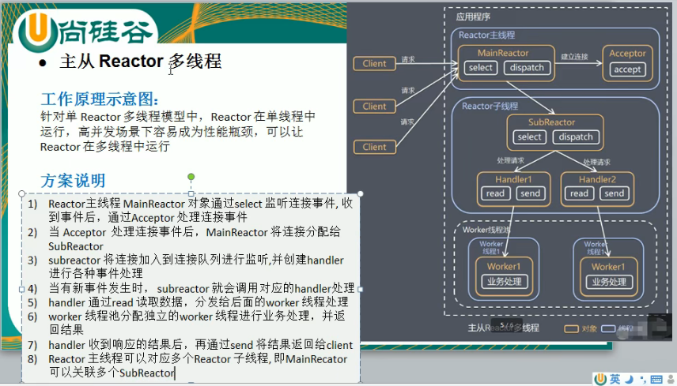

## bio 同步阻塞
1. 服务器端需要开启多线程监听客户端的连接
2. 客户端要始终维持和服务器的连接
3.   
    [示列代码](./thread_io_netty/BioSocketModel.java)
4. 
## nio 同步非阻塞
1. 服务器只需要一个线程就可以监听多个客户端
2. 客户端不需要一直维持和服务器的连接
3. 一个selector上可以注册多个channel 只有当channel的绑定事件有触发时才和该channel通信
4.   
    [示列代码](./thread_io_netty/NioSocketModel.java)
5. 一个简单的im通信过程  
    [服务器](./thread_io_netty/NioImServerModel.java)  [客户端](./thread_io_netty/NioImClientModel.java)
## 零拷贝 没有cpu拷贝
1. 传统io拷贝(3次状态切换 4次拷贝)  
      
    [示列代码](./thread_io_netty/BioFileTransferModel.java)
2. nio拷贝(对bio优化)
    - mMap拷贝(3次状态切换 3次拷贝)
    
    - sendFile拷贝(2次状态切换 2次拷贝)
    
      
    [示列代码](./thread_io_netty/NioFileTransferModel.java)
## Reactor模式
1. 基于事件驱动 io多路复用的线程模型
    
2. 不同的实现分类
    1. 单Reactor单线程
        - 使用一个线程完成所有转发和处理请求
        
        - 优点: 模型简单 编码实现简单 没有多线程之间通信竞争问题
        - 缺点: 单线程无法发挥多核cpu的优势  
                Handler在处理连接请求时无法同时处理其他业务  
                通信不可靠 如果线程意外终止或者死循环 整个通信链都将不可用
    2. 单Reactor多线程
        - 主线程运行Reactor handler交由多线程执行
        
        - 优点: 可以充分发挥多核cpu的优势
        - 缺点: 多线程之间数据共享交换 与资源竞争问题  
                Reactor仍然运行在单线程下 无法同时处理大量连接请求
    3. 多Reactor多线程
        - 将Reactor拆分到多个subreactor Reactor和Handler都交由多线程执行
        
        
        - 优点: 按模块拆分结构  
            主线程只处理连接请求无需接收子线程的返回结果  
            子线程进行业务处理返回结果可以直接返回到client
        - 缺点: 编程实现难度较大
        - 实际应用例子: nginx memcached netty
## netty 基于 Reactor主从多线程实现
1. 模型图
    
2. channel pipeline handler
    - channel中维护一个双向链表pipeline管理当前channel的数据处理链
    - 出战 数据从自定义handler传输至下一个encoder   从tail传输至head
    - 入战 数据从decoder传输至自定义handler   从head传输至tail
3. protobuf
    - 轻便高效结构化数据存储格式 适合做数据存储和数据交互 http+json -----> tcp+protobuf
    - 跨平台 跨语言
4. tcp粘包 拆包
    1. tcp是面向连接 面向流 需要维护服务器和客户端双向的连接 有一一对应的socket
    2. 数据传输时tcp采用Nagle算法将时间间隔较短多次发送的数据小包合并成一个大的数据块发送 提高发送效率
    3. 面向流的数据传输没有消息边界 就会出现数据粘包拆包问题