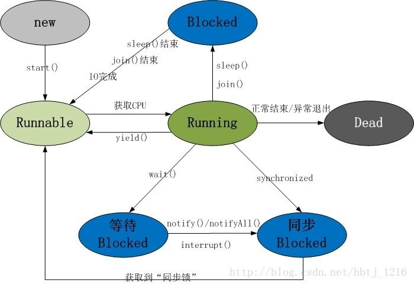

## 线程流程
1. 线程共包括以下5种状态
    - 新建状态(New)：线程对象被创建后，就进入了新建状态。例如，Thread thread = new Thread()。
    - 就绪状态(Runnable)： 也被称为“可执行状态”。线程对象被创建后，其它线程调用了该对象的start()方法，从而来启动该线程。例如，thread.start()。处于就绪状态的线程，随时可能被CPU调度执行。
    - 运行状态(Running) : 线程获取CPU权限进行执行。需要注意的是，线程只能从就绪状态进入到运行状态。
    - 阻塞状态(Blocked)： 阻塞状态是线程因为某种原因放弃CPU使用权，暂时停止运行。直到线程进入就绪状态，才有机会转到运行状态。阻塞的情况分三种：
        - (01) 等待阻塞 -- 通过调用对象的wait()方法，让线程等待notify()/notifyAll()被调用。
        - (02) 同步阻塞 -- 线程在获取synchronized同步锁失败（因为锁被其它线程所占用），它会进入同步阻塞状态。
        - (03) 其他阻塞 -- 通过调用线程的sleep()或join()或发出了I/O请求时，线程会进入到其他阻塞状态。当sleep()状态超时、join()等待线程终止或者超时、或者I/O处理完毕时，线程重新转入就绪状态。
    - 死亡状态(Dead)：线程执行完毕或者因异常退出了run()方法，该线程结束生命周期。
    - 
2. 这5种状态涉及到的内容包括Object类, Thread和synchronized关键字。
3. Object类，定义了wait(), notify(), notifyAll()等休眠/唤醒函数。
4. Thread类，定义了一系列的线程操作函数。例如，sleep()休眠函数, interrupt()中断函数, getName()获取线程名称等。
5. synchronized，是关键字；它区分为synchronized代码块和synchronized方法。synchronized的作用是让线程获取对象的同步锁。加锁解锁过程自动 不可手动中断
## 异常与错误
1. 检查异常checked exception
    - 非运行时异常 可以通过程序捕获处理 使程序完成编译 正常运行的程序不应该出现这类异常
    - SQLException,IOException,NamingException,TimeoutException  
        NotBoundException,ParseException,XMLParseException  
        NoSuchMethodException,NoSuchFieldException
2. 非检查异常runtime exception
    - 运行时异常 程序运行过程中产生的不可预估的异常 某些也可以通过异常捕获做相应处理
    - NullPointerException,ClassCastException,IllegalArgumentException  
        IndexOutOfBoundsException,ArithmeticException,NoSuchMechanismException  
        NumberFormatException,UncheckedIOException
## java8 集合
1. HashMap
    1. 构造方法
       - HashMap()						默认扩容因子0.75,不计算扩容阈值
       - HashMap(int initialCapacity)	默认扩容因子0.75,使用tableSizeFor按位位移计算>=initialCapacity最小的2^n值,作为扩容阈值
       ```java
            int n = initialCapacity - 1;
            n |= n >>> 1;
            n |= n >>> 2;
            n |= n >>> 4;
            n |= n >>> 8;
            n |= n >>> 16;
            n = (n < 0) ? 1 : (n >= MAXIMUM_CAPACITY) ? MAXIMUM_CAPACITY : (n + 1);
        ```
       - HashMap(int initialCapacity,float loadFactor)
    2. put
        - 使用key对应类的hash	hashCode ^ hashCode>>>16	任何数和0异或运算等于自身
        - 使用初始容量最大索引&hash获得对应key在节点中的下标		
        - (table.length -1) & hash	高n位全部是0,低n位全部是1;任何数和1与运算等于自身,任何数和0与运算等于0,因此下标值等于hash的低n位
        - 由于Object各子类中的hashCode方法重载实现不尽相同,获得到的下标没有固定的顺序,所有Map集合元素是无序的
        - 使用新计算的下标获取table中对应的值p
            - 如果p等于空表示该位置还没有被存储过,使用传递的key和value以及计算好的hash生成一个节点存入该位置,size+1
            - 如果p不等于空表示该位置已存入数据
                - 如果p的hash值和hash相等并且p的key等于key,表示带存入的值和已存入的值相同,不做处理
                - 如果上述条件不成立,表示不同hash计算得到同一个下标,存入p指向的下一个节点,等待扩容时重新分配下标,size+1
                - 这里是一个递归的设计,所以应该在使用前就设计好大致的数组容量
                - 当扩容因子>1时,所有超出容量范围的数据,会先存储在某节点指向的一下个节点中,等到做扩容时,再重新分配新的下标
                - 在扩容之前,想要获取的该值就必须使用递归遍历获取
                - 使用时应该避免扩容时重新分配计算hash填充数组以及因为递归的无限循环而带来的重复判断
    3. resise
        - 在第一次使用put时,首次扩容,之所以不在构造方法中扩容,是为了能够最大程度的减少多内存的创建开销
        - 如果节点数组的长度大于0且长度大于默认容量16小于最大容量2^30的一半2^15,把原来的容量和阈值都扩大一倍
        - 不满足上面的条件,原来的容量扩大一倍,再使用新容量*扩容因子计算新的扩容阈值
        - 扩容后原数组的数据重新使用hash算法获取下标重新填充到新数组
        - 如果节点数组的长度为0且扩容阈值不为0,使用扩容阈值初始化节点数组大小,并使用扩容阈值*扩容因子计算新的扩容阈值,对应到1.2和1.3
        - 如果扩容阈值为0,使用默认扩容阈值16,默认扩容因子0.75初始化数组大小和计算新的扩容阈值,对应到1.1
    4. get
        - 采用和put一样的方案获取hash和数组下标,根据下标获取数组中的节点
        - 如果没有节点返回null
        - 如果有节点且节点的hash和key与计算的hash传递的key都相等,返回该节点
        - 如果有节点但是hash值不相等,循环遍历当前节点的所有子节点,直至找到对应的节点,并返回
2. HashSet 本质上HashSet就是HashMap
    1. 构造方法
        - HashSet()   使用默认的HashMap构造方法同一、1.1
        - HashSet(int initialCapacity)  同一、1.2
        - HashSet(int initialCapacity,float loadFactor)  同一、1.3
    2. add(E e)
        将e作为map的key存入,map的所有value为Object，因为map的key值不重复所以HashSet也不重复
3. ArrayList
    1. 构造方法
        - ArrayList()         创建一个空的数组
        - ArrayList(int initialCapacity)  根据传递的初始容量，创建对应长度的数组
    2. add
        - 获取数组中有值的长度len，使用len+1作为下一个数据待填入数组中的位置，比较该值与数据长度比较
        - 如果超出长度使用扩容算法
        - 没有超出长度，顺序填入
    3. grow扩容算法
        - 获取原数组长度len
        - 如果Len=0，设置扩容长度为默认长度10
        - 如果len>0，len右移移位(截取一半)，合并到原数组长度，扩容一半的长度
        - 在原数组的基础上增加对应长度的数组
        - 构造方法最好还是使用有参的，减少数组的扩容
    4. add(int index, E element)----不推荐使用
        - 先判断是否需要使用扩容算法
        - index下标之前的数据不移动，index之后的数据全部后移一位，空出index位存放element
        - 正是因为有这些位移的操作，ArrayList才是有序的集合
4. LinkedList
    1. Node
        - prev    前继节点
        - item    当前节点存放的值
        - next    后继节点
    2. firstNode 首节点 没有前继节点
    3. lastNode 尾节点 没有后继节点
    4. push  压入首节点(有点类似栈的设计)
    5. add(int index, E element) 在指定节点前面插入节点
    6. set(int index, E element) 替换指定节点
    7. add   追加至尾节点
    8. peek,peekFirst,element,getFirst    弹出首节点且不删除原数据
    9. poll,pollFirst,remove,removeFirst,pop    弹出首节点同时删除原数据
    10. peekLast,getLast    弹出尾节点且不删除原数据
    11. pollLast    弹出尾节点同时删除原数据
## cron表达式
1. 格式含义 {秒数} {分钟} {小时} {日期} {月份} {星期} {年份(可为空)}
1. 秒
    - 允许值范围: 0~59 ,不允许为空值，若值不合法，调度器将抛出SchedulerException异常
    - "*" 代表每隔1秒钟触发
    - "," 代表在指定的秒数触发，比如"0,15,45"代表0秒、15秒和45秒时触发任务
    - "-" 代表在指定的范围内触发，比如"25-45"代表从25秒开始触发到45秒结束触发，每隔1秒触发1次
    - "/" 代表触发步进(step)，"/"前面的值代表初始值("*"等同"0")，后面的值代表偏移量，比如"0/20"或者"*/20"代表从0秒钟开始，每隔20秒钟触发1次，即0秒触发1次，20秒触发1次，40秒触发1次；"5/20"代表5秒触发1次，25秒触发1次，45秒触发1次；"10-45/20"代表在[10,45]内步进20秒命中的时间点触发，即10秒触发1次，30秒触发1次
2. 分钟
    - 允许值范围: 0~59 ,不允许为空值，若值不合法，调度器将抛出SchedulerException异常
    - "*" 代表每隔1分钟触发
    - "," 代表在指定的分钟触发，比如"10,20,40"代表10分钟、20分钟和40分钟时触发任务
    - "-" 代表在指定的范围内触发，比如"5-30"代表从5分钟开始触发到30分钟结束触 发，每隔1分钟触发
    - "/" 代表触发步进(step)，"/"前面的值代表初始值("*"等同"0")，后面的值代表偏移量，比如"0/25"或者"*/25"代表从0分钟开始，每隔25分钟触发1次，即0分钟触发1次，第25分钟触发1次，第50分钟触发1次；"5/25"代表5分钟触发1次，30分钟触发1次，55分钟触发1次；"10-45/20"代表在[10,45]内步进20分钟命中的时间点触发，即10分钟触发1次，30分钟触发1次
3. 小时
    - 允许值范围: 0~23 ,不允许为空值，若值不合法，调度器将抛出SchedulerException异常
    - "*" 代表每隔1小时触发
    - "," 代表在指定的时间点触发，比如"10,20,23"代表10点钟、20点钟和23点触发任务
    - "-" 代表在指定的时间段内触发，比如"20-23"代表从20点开始触发到23点结束触发，每隔1小时触发
    - "/" 代表触发步进(step)，"/"前面的值代表初始值("*"等同"0")，后面的值代表偏移量，比如"0/1"或者"*/1"代表从0点开始触发，每隔1小时触发1次；"1/2"代表从1点开始触发，以后每隔2小时触发一次
4. 日期
    - 允许值范围: 1~12 (JAN-DEC),不允许为空值，若值不合法，调度器将抛出SchedulerException异常
    - "*" 代表每个月都触发
    - "," 代表在指定的月份触发，比如"1,6,12"代表1月份、6月份和12月份触发任务
    - "-" 代表在指定的月份范围内触发，比如"1-6"代表从1月份开始触发到6月份结束触发，每隔1个月触发
    - "/" 代表触发步进(step)，"/"前面的值代表初始值("*"等同"1")，后面的值代表偏移量，比如"1/2"或者"*/2"代表从1月份开始触发，每隔2个月触发1次；"6/6"代表从6月份开始触发，以后每隔6个月触发一次；"1-6/12"表达式意味着每年1月份触发
5. 月份
    - 允许值范围: 1~12 (JAN-DEC),不允许为空值，若值不合法，调度器将抛出SchedulerException异常
    - "*" 代表每个月都触发
    - "," 代表在指定的月份触发，比如"1,6,12"代表1月份、6月份和12月份触发任务
    - "-" 代表在指定的月份范围内触发，比如"1-6"代表从1月份开始触发到6月份结束触发，每隔1个月触发
    - "/" 代表触发步进(step)，"/"前面的值代表初始值("*"等同"1")，后面的值代表偏移量，比如"1/2"或者"*/2"代表从1月份开始触发，每隔2个月触发1次；"6/6"代表从6月份开始触发，以后每隔6个月触发一次；"1-6/12"表达式意味着每年1月份触发
6. 星期
    - 允许值范围: 1~7 (SUN-SAT),1代表星期天(一星期的第一天)，以此类推，7代表星期六(一星期的最后一天)，不允许为空值，若值不合法，调度器将抛出SchedulerException异常
    - "*" 代表每星期都触发；
    - "?" 与{日期}互斥，即意味着若明确指定{日期}触发，则表示{星期}无意义，以免引起冲突和混乱
    - "," 代表在指定的星期约定触发，比如"1,3,5"代表星期天、星期二和星期四触发
    - "-" 代表在指定的星期范围内触发，比如"2-4"代表从星期一开始触发到星期三结束触发，每隔1天触发
    - "/" 代表触发步进(step)，"/"前面的值代表初始值("*"等同"1")，后面的值代表偏移量，比如"1/3"或者"*/3"代表从星期天开始触发，每隔3天触发1次；"1-5/2"表达式意味着在[1,5]范围内，每隔2天触发，即星期天、星期二、星期四触发
    - "L" 如果{星期}占位符如果是"L"，即意味着星期的的最后一天触发，即星期六触发，L= 7或者 L = SAT，因此，"5L"意味着一个月的最后一个星期四触发
    - "#" 用来指定具体的周数，"#"前面代表星期，"#"后面代表本月第几周，比如"2#2"表示本月第二周的星期一，"5#3"表示本月第三周的星期四，因此，"5L"这种形式只不过是"#"的特殊形式而已
7. 年份
    - 允许值范围: 1970~2099 ,允许为空，若值不合法，调度器将抛出SchedulerException异常
    - "*"代表每年都触发
    - ","代表在指定的年份才触发，比如"2011,2012,2013"代表2011年、2012年和2013年触发任务
    - "-"代表在指定的年份范围内触发，比如"2011-2020"代表从2011年开始触发到2020年结束触发，每隔1年触发
    - "/"代表触发步进(step)，"/"前面的值代表初始值("*"等同"1970")，后面的值代表偏移量，比如"2011/2"或者"*/2"代表从2011年开始触发，每隔2年触发1次
    - 注意：除了{日期}和{星期}可以使用"?"来实现互斥，表达无意义的信息之外，其他占位符都要具有具体的时间含义，且依赖关系为：年->月->日期(星期)->小时->分钟->秒数
8. 特殊字符
    - “*”字符被用来指定所有的值。如："*"在分钟的字段域里表示“每分钟”。
    - “?”字符只在日期域和星期域中使用。它被用来指定“非明确的值”。当你需要通过在这两个域中的一个来指定一些东西的时候，它是有用的。看下面的例子你就会明白。 月份中的日期和星期中的日期这两个元素时互斥的一起应该通过设置一个问号来表明不想设置那个字段。
    - “-”字符被用来指定一个范围。如：“10-12”在小时域意味着“10点、11点、12点”。
    - “,”字符被用来指定另外的值。如：“MON,WED,FRI”在星期域里表示”星期一、星期三、星期五”。
    - “/”字符用于指定增量。如：“0/15”在秒域意思是每分钟的0，15，30和45秒。“5/15”在分钟域表示每小时的5，20，35和50。符号“*”在“/”前面（如：*/10）等价于0在“/”前面（如：0/10）。记住一条本质：表达式的每个数值域都是一个有最大值和最小值的集合，如：秒域和分钟域的集合是0-59，日期域是1-31，月份域是1-12。字符“/”可以帮助你在每个字符域中取相应的数值。如：“7/6”在月份域的时候只有当7月的时候才会触发，并不是表示每个6月。
    - “L”是‘last’的省略写法可以表示day-of-month和day-of-week域，但在两个字段中的意思不同，例如day-of-month域中表示一个月的最后一天。如果在day-of-week域表示‘7’或者‘SAT’，如果在day-of-week域中前面加上数字，它表示一个月的最后几天，例如‘6L’就表示一个月的最后一个星期五。
    - “W”只允许日期域出现。这个字符用于指定日期的最近工作日。例如：如果你在日期域中写 “15W”，表示：这个月15号最近的工作日。所以，如果15号是周六，则任务会在14号触发。如果15好是周日，则任务会在周一也就是16号触发。如果是在日期域填写“1W”即使1号是周六，那么任务也只会在下周一，也就是3号触发，“W”字符指定的最近工作日是不能够跨月份的。字符“W”只能配合一个单独的数值使用，不能够是一个数字段，如：1-15W是错误的。
    - “L”和“W”可以在日期域中联合使用，LW表示这个月最后一周的工作日。
    - “#”只允许在星期域中出现。这个字符用于指定本月的某某天。例如：“6#3”表示本月第三周的星期五（6表示星期五，3表示第三周）。“2#1”表示本月第一周的星期一。“4#5”表示第五周的星期三。
    - “C”允许在日期域和星期域出现。这个字符依靠一个指定的“日历”。也就是说这个表达式的值依赖于相关的“日历”的计算结果，如果没有“日历”关联，则等价于所有包含的“日历”。如：日期域是“5C”表示关联“日历”中第一天，或者这个月开始的第一天的后5天。星期域是“1C”表示关联“日历”中第一天，或者星期的第一天的后1天，也就是周日的后一天（周一）。
9. 表达式举例
    - "0 0 12 * * ?" 每天中午12点触发
    - "0 15 10 ? * *" 每天上午10:15触发
    - "0 15 10 * * ?" 每天上午10:15触发
    - "0 15 10 * * ? *" 每天上午10:15触发
    - "0 15 10 * * ? 2005" 2005年的每天上午10:15触发
    - "0 * 14 * * ?" 在每天下午2点到下午2:59期间的每1分钟触发
    - "0 0/5 14 * * ?" 在每天下午2点到下午2:55期间的每5分钟触发
    - "0 0/5 14,18 * * ?" 在每天下午2点到2:55期间和下午6点到6:55期间的每5分钟触发
    - "0 0-5 14 * * ?" 在每天下午2点到下午2:05期间的每1分钟触发
    - "0 10,44 14 ? 3 WED" 每年三月的星期三的下午2:10和2:44触发
    - "0 15 10 ? * MON-FRI" 周一至周五的上午10:15触发
    - "0 15 10 15 * ?" 每月15日上午10:15触发
    - "0 15 10 L * ?" 每月最后一日的上午10:15触发
    - "0 15 10 ? * 6L" 每月的最后一个星期五上午10:15触发
    - "0 15 10 ? * 6L 2002-2005" 2002年至2005年的每月的最后一个星期五上午10:15触发
    - "0 15 10 ? * 6#3" 每月的第三个星期五上午10:15触发
## maven
1. 将jar打包放入maven库中 mvn install:install-file -Dpackaging=jar -Dfile=jar路径 -DgroupId= -DartifactId= -Dversion=
2. 忽略单元测试
   - mvn clean package -Dmaven.test.skip=true 跳过单元测试也不编译测试代码
   - mvn clean package -DskipTests=true 跳过单元测试但正常编译测试代码
   - ```dtd
            <plugin>
                <groupId>org.apache.maven.plugins</groupId>
                <artifactId>maven-surefire-plugin</artifactId>
                <version>${maven.surefire.plugin}</version>
                <configuration>
                    <skipTests>true</skipTests>
                </configuration>
            </plugin>
    ```